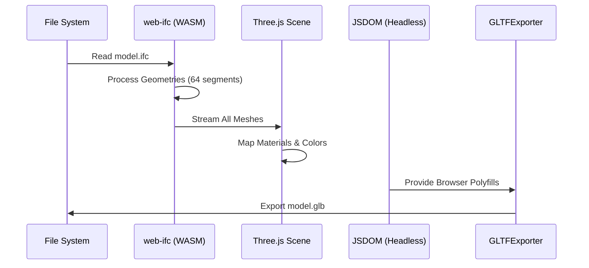

# High-Quality IFC to GLB Converter

This Node.js utility provides a robust pipeline for converting **IFC (Industry Foundation Classes)** building models into **GLB (GL Transmission Format)** for high-performance web rendering. 

It is specifically designed to work with the [ifcLiteViewer](https://github.com/textonym/ifcLiteViewer) for Power BI, ensuring optimal geometry tessellation and material adherence.

## Workflow

The conversion process utilizes a headless 3D environment to process and export the geometry:



## Features

- **High-Precision Tessellation**: Configurable circle segments (default 64) for smooth architectural curves.
- **Material Preservation**: Accurately maps IFC colors and transparency settings to PBR materials.
- **Headless Execution**: Uses `JSDOM` to enable `Three.js` exporters to run directly in Node.js.
- **WASM Powered**: Leverages `web-ifc`'s WASM engine for high-speed parsing of large IFC files.

## Usage

### 1. Preparation
Place your `model.ifc` file in the root of the converter directory.

### 2. Installation
```bash
npm install
```

### 3. Run Conversion
```bash
npm run convert
```

The output `model.glb` will be generated in the same directory, ready for use in any GLTF-compatible viewer.

## Technical Details

- **Core Engine**: `web-ifc`
- **Tuning**: Geometry quality is set via `CIRCLE_SEGMENTS: 64` in `convert.mjs`.
- **Environment**: Node.js with `JSDOM` polyfills for `Blob`, `FileReader`, and `URL`.

## License
MIT
